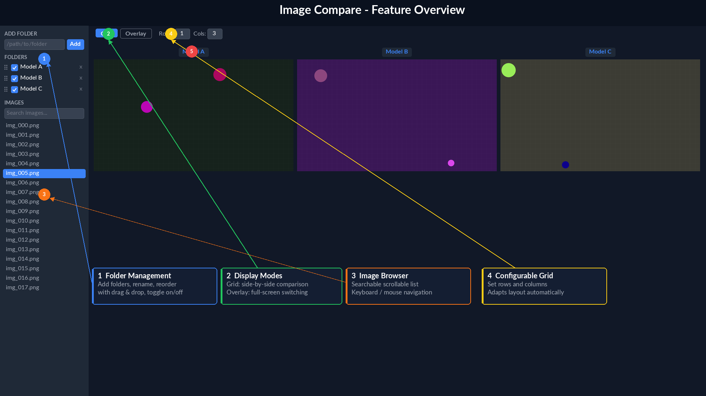
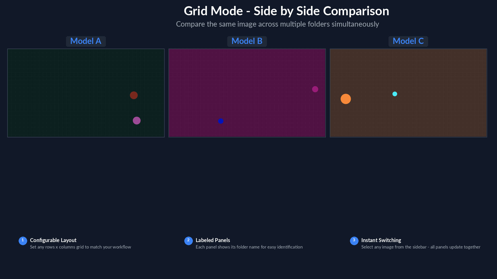
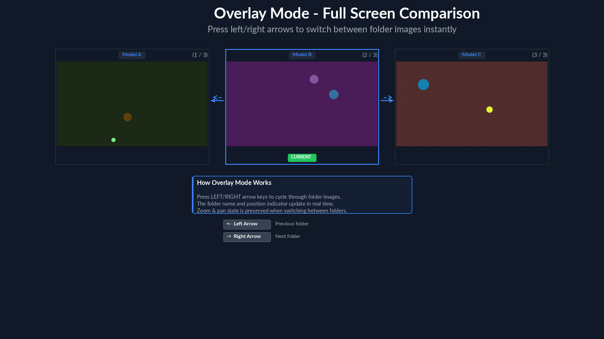
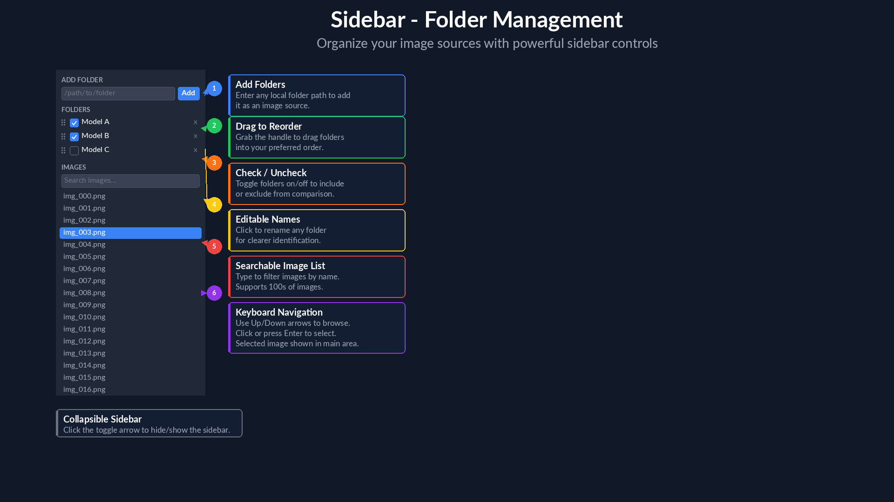
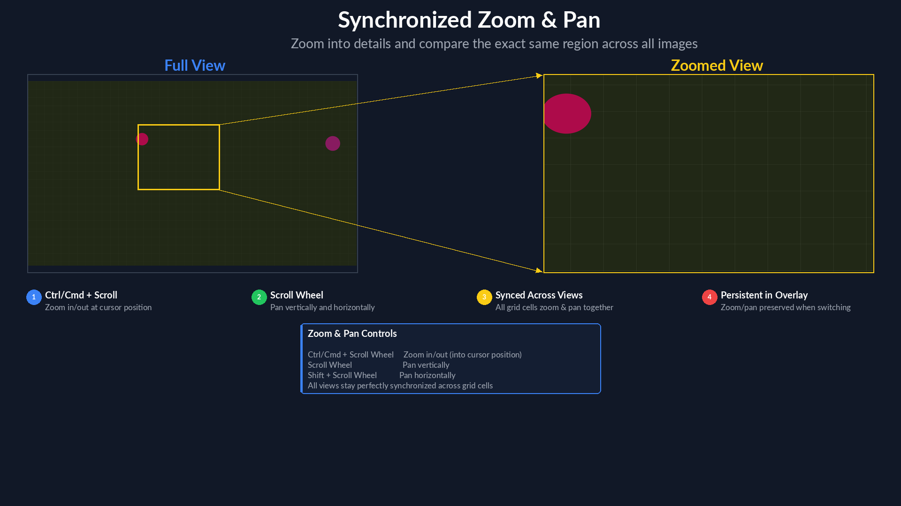

# Compare Images Across Folders

A local web application for comparing images with the same name across multiple folders. Built for workflows like evaluating model outputs, reviewing rendering passes, or any task where you need to visually compare corresponding images side by side.



## Features

### Grid Mode
Compare images from all selected folders simultaneously in a configurable rows x columns grid. Each cell is labeled with the folder name.



### Overlay Mode
View a single image at full size and press the **left/right arrow keys** to instantly switch between the same image from different folders. The current folder name and position indicator are shown above the image.



### Folder Management
- **Add folders** by entering their absolute path
- **Rename** folders inline for clearer identification
- **Drag to reorder** folders to control display order
- **Toggle on/off** with checkboxes to include or exclude folders from comparison
- **Check all / Uncheck all** with the checkbox in the Folders header
- **Copy path** to clipboard via the copy button on each folder
- **Remove** folders with one click



### Searchable Image Browser
- Scrollable list of all image names that exist across **every** selected folder (intersection)
- **Search** to filter images by name
- **Keyboard navigation** with Up/Down arrow keys, or click to select

### Strict / Non-Strict Matching
- **Strict matching** (default) — images match only when their filenames (without extension) are identical across folders
- **Non-strict matching** — images match when one filename contains the other (e.g. `render_001` matches `render_001_enhanced`). Toggle via the **Strict matching** checkbox above the image list

### Synchronized Zoom & Pan
- **Ctrl/Cmd + Scroll Wheel** to zoom in/out at the cursor position
- **Scroll Wheel** to pan vertically
- **Horizontal Scroll** to pan horizontally
- Zoom and pan are **synced across all grid cells** so you always compare the exact same region
- In Overlay mode, zoom/pan state **persists** when switching between folders



### Collapsible Sidebar
Click the toggle arrow to collapse or expand the sidebar, maximizing the display area when needed.

### Save, Load & Share State
- **Save** the current folder configuration to a JSON file
- **Load** a previously saved configuration from a JSON file
- **Copy shareable link** — encodes the full app state (folders, matching mode, display settings) into the URL, so you can share it with colleagues on the same network

### Screenshot
Click the camera icon in the toolbar to capture the full app view. The browser will ask you to confirm tab sharing on the first use. On HTTPS or localhost, the image is copied directly to the clipboard. On plain HTTP, it downloads as a PNG file instead (browser security restriction).

### Keyboard Shortcuts

| Key | Action |
|---|---|
| **G** | Switch to Grid mode |
| **O** | Switch to Overlay mode |
| **Up / Down** | Navigate the image list |
| **Left / Right** | Cycle through folders (Overlay mode) |
| **Ctrl/Cmd + Scroll** | Zoom in/out |
| **Scroll** | Pan |

## Requirements

- Python 3.9+
- Flask

## Installation

```bash
pip install -r requirements.txt
```

## Usage

1. Start the server:

```bash
python app.py
```

**Command-line options:**

| Option | Description |
|---|---|
| `-p`, `--port PORT` | Port to run the server on (default: `5000`) |
| `--auto-port` | Automatically pick an available port |
| `--public` | Listen on all interfaces (`0.0.0.0`) so the app is accessible over the network |
| `--ssl` | Enable HTTPS with an auto-generated self-signed certificate |
| `--ssl-cert FILE` | Path to your own SSL certificate (use with `--ssl-key`) |
| `--ssl-key FILE` | Path to your own SSL private key (use with `--ssl-cert`) |

Examples:

```bash
python app.py --port 8080
python app.py --auto-port
python app.py --public --port 9000
python app.py --public --ssl
python app.py --ssl-cert cert.pem --ssl-key key.pem
```

2. Open your browser and go to **http://localhost:5000**

3. Add image folders:
   - Paste an absolute folder path into the input field at the top of the sidebar
   - Click **Add** (folders must contain supported image files)

4. Select an image from the sidebar list — the main area will display the matching images from all selected folders.

5. Switch between **Grid** and **Overlay** modes using the toggle buttons at the top (or press **G** / **O**).

6. In Grid mode, adjust the **Rows** and **Cols** controls to change the layout.

7. In Overlay mode, press **Left/Right arrow keys** to cycle through folder images.

8. Use **Ctrl/Cmd + Scroll** to zoom into details, and **Scroll** to pan around.

9. Uncheck **Strict matching** to compare images with similar (but not identical) names across folders.

## Supported Image Formats

PNG, JPG, JPEG, GIF, WebP, TIFF, BMP, SVG

## Wishlist

1. **Diff image & image manipulation tools** — Add a button to generate difference images between folders, along with other manipulation tools (e.g. brightness/contrast adjustment, channel isolation).
2. **Automatic metric calculation & display** — Compute and show image similarity metrics (e.g. PSNR, SSIM, LPIPS) between corresponding images across folders.
3. **Performance optimizations** — Improve speed and reduce memory usage for large image sets and high-resolution files (lazy loading, tiling, downsampled previews).

## Project Structure

```
├── app.py                  # Flask backend (API + image serving)
├── requirements.txt        # Python dependencies
├── templates/
│   └── index.html          # Main HTML template
└── static/
    ├── css/
    │   └── style.css       # Custom styles
    └── js/
        └── app.js          # Frontend logic (state, rendering, zoom/pan)
```
